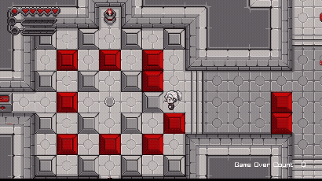
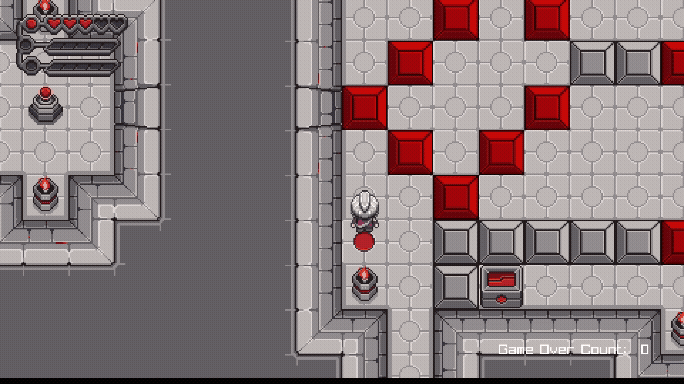
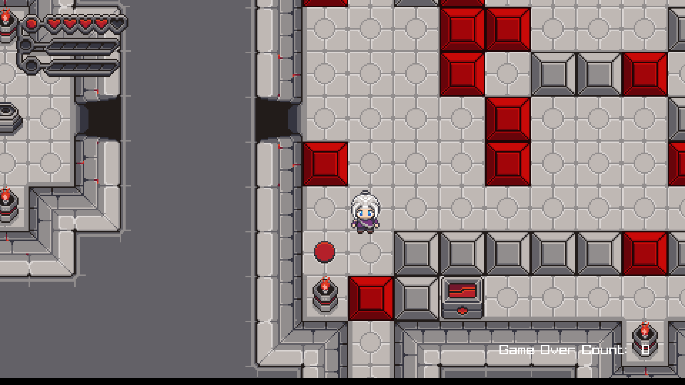
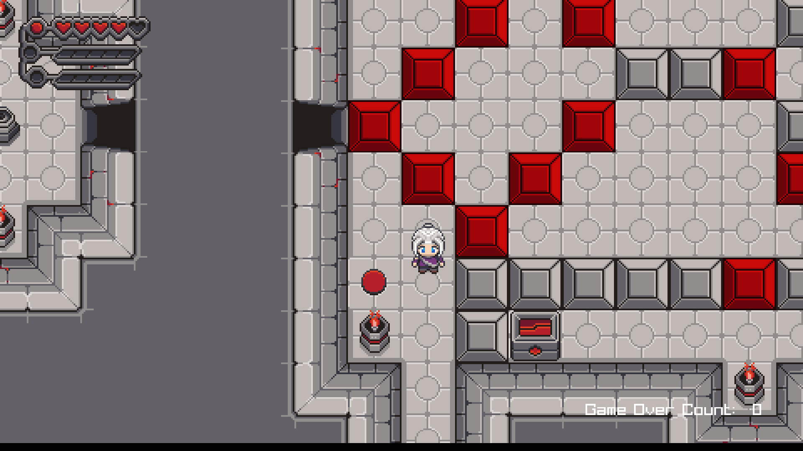
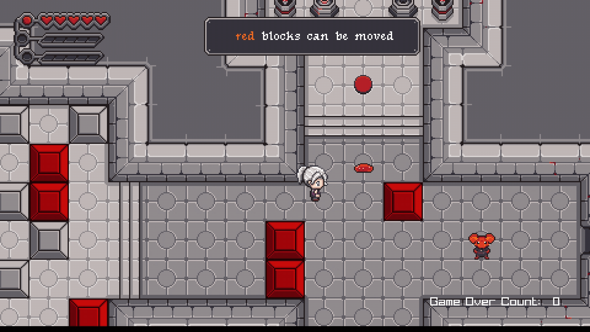

# Chroma Quest: The Lost Colors

Chroma Quest: The Lost Colors is a 2D puzzle adventure in which the player clears towers to bring color back to the world.

> Portfolio documentation fork  
> This project was developed as a team project. This fork focuses on project documentation, media, my own programming contributions, and the technical parts I can explain in detail.  
> The original repository is linked through GitHub's fork relationship.

## Overview

Chroma Quest: The Lost Colors is a 2D puzzle adventure built with C++, raylib and CMake. The project was created as a second-semester university project.

The player explores a world where the power of color has been stolen. To restore it, the player has to clear three towers and recover the three main colors.

Each tower contains NPC interactions, enemies, puzzles and boss encounters. This portfolio fork focuses on the systems I worked on directly, especially the base game structure, player controller, collision handling and puzzle interactions.

## My Role

I worked on this project as one of two programmers.

My main contributions:

- Created the base project structure, including the game loop
- Implemented the player controller with movement, attack handling and collision checks
- Implemented hitbox and collider logic for player interactions
- Implemented physics-based puzzle interactions such as pressure plates and stone pushing
- Worked on basic UI and game state handling

## Technical Focus

- C++ gameplay programming
- raylib
- CMake project setup
- Game loop structure
- Input handling
- Player controller logic
- Hitbox and collision handling
- Physics-based puzzle interactions
- Basic UI and game state handling

## Media

### Physics Puzzle Interaction

The puzzle system uses movable stones and pressure plates to open secret doors and progress through the level.

| Stone Push Puzzle 1 | Stone Push Puzzle 2 |
|---|---|
|  |  |

### Pressure Plate Reset

The position of the stones can be reset by certain pressure plates, allowing puzzle states to return to their previous setup.

| Before Reset | After Reset |
|---|---|
|  |  |

### Gameplay Context

| Player Controller / Gameplay |
|---|
|  |

## How to Play / Run

Download:

- Itch.io: [Chroma Quest: The Lost Colors](https://chromaquest.itch.io/chroma-quest-the-lost-colors)

Setup:

1. Download `ChromaSetUp.exe`.
2. Run the installer.
3. If Windows SmartScreen shows a warning, click **More info** and then **Run anyway**.
4. Select an installation folder.
5. Optionally create a desktop shortcut.
6. Click **Install** and wait for the installation to complete.
7. Launch the game from the desktop shortcut or the Start Menu.

Supported platform:

- Windows
- Designed for `1920x1080` resolution

Note:
- The prototype does not include an in-game quit option. Use `Alt + F4` to close the game.

## Project Context

This project was developed as a university team project.

This fork is used as a portfolio documentation version. It does not replace the original team repository and does not attempt to list every team member's contribution. The sections above focus on my own work and the technical areas I can discuss in detail.

This fork reflects the final submitted version of the project.

## Links

- Original repository: [LinusKorihs/Chroma-Quest-The-Lost-Colors](https://github.com/LinusKorihs/Chroma-Quest-The-Lost-Colors)
- [Portfolio](https://linustheuringer.com)
- Itch.io: [Chroma Quest: The Lost Colors](https://chromaquest.itch.io/chroma-quest-the-lost-colors)
- Mail: [Linustheuringer@gmail.com](https://linustheuringer@gmail.com)
